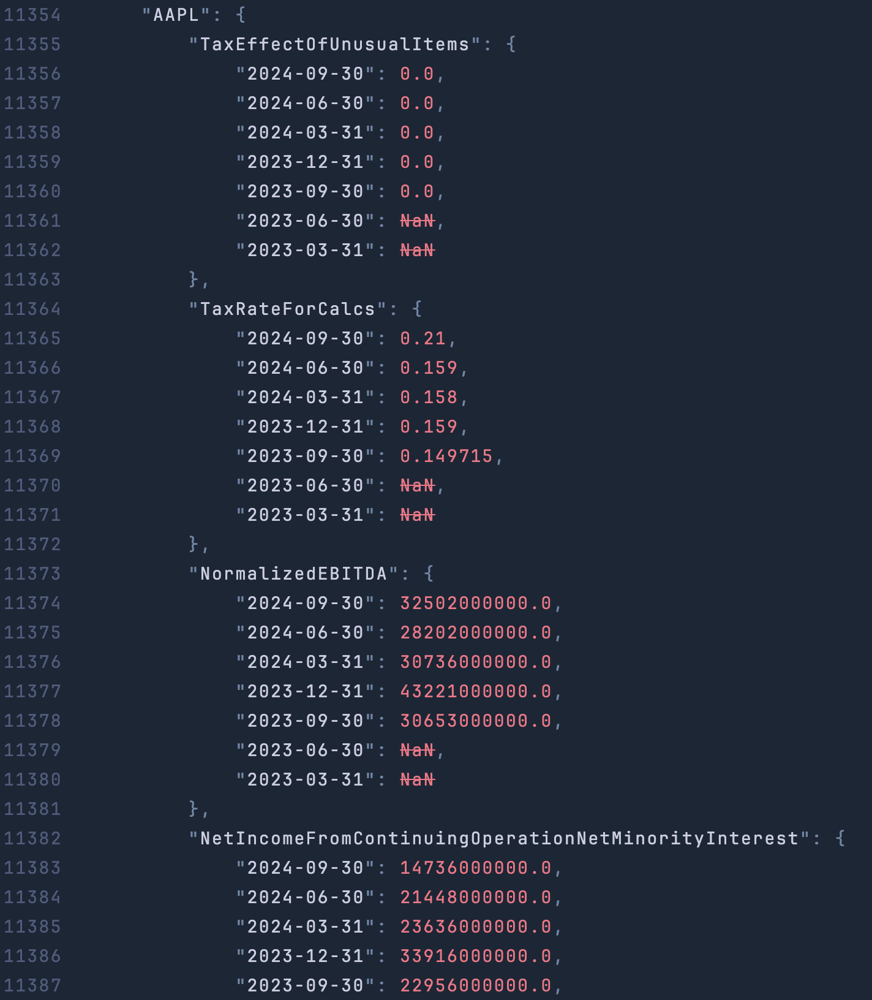
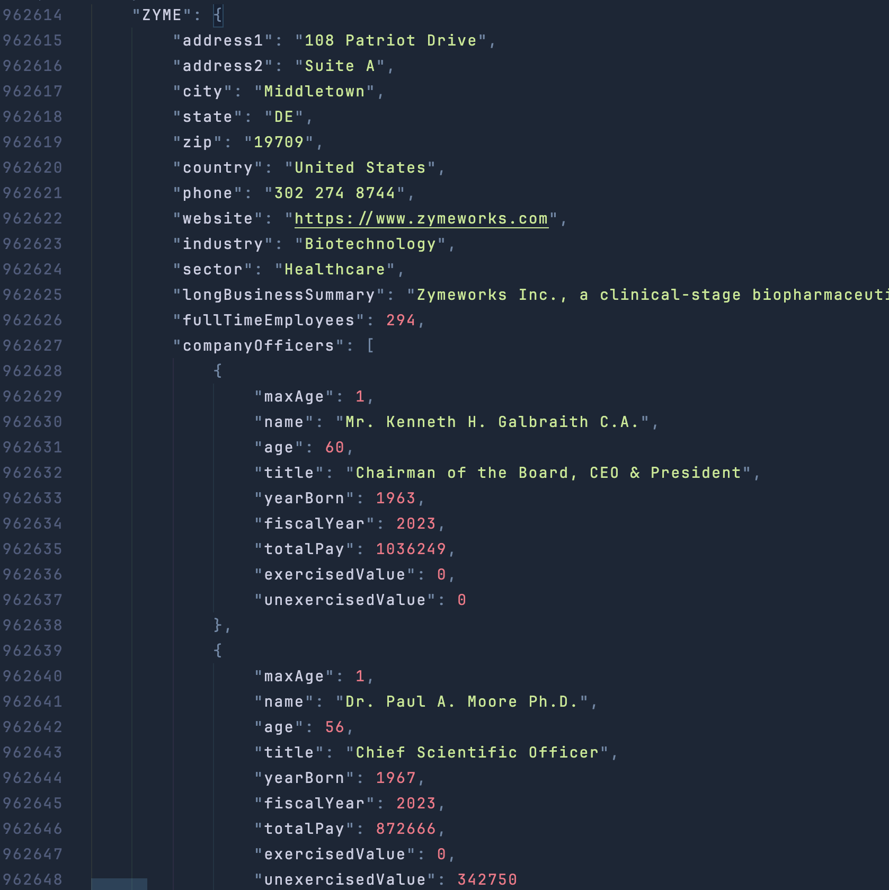
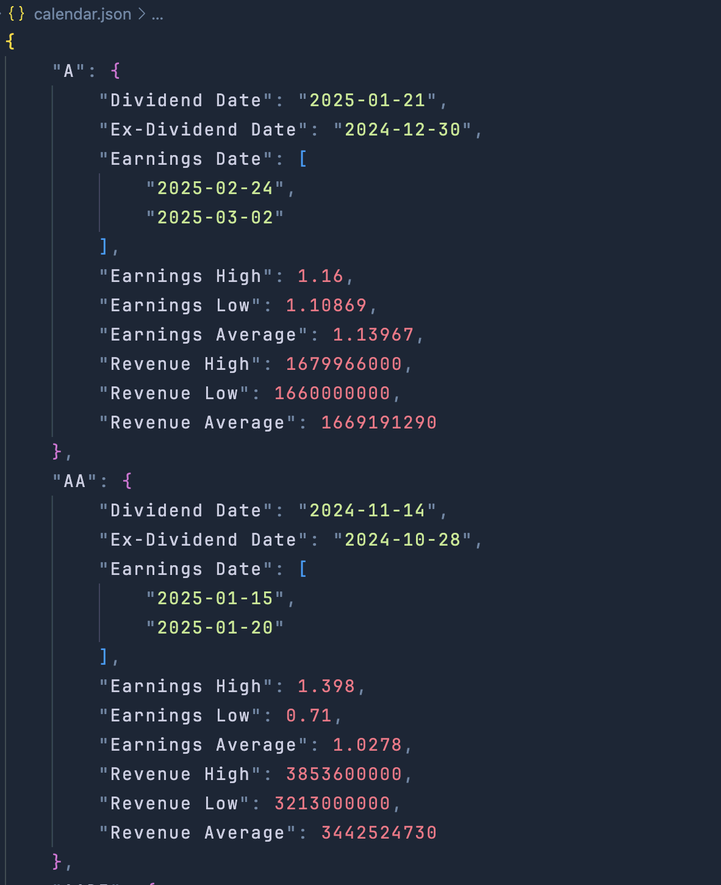

## About

This repository provides a simple tool for downloading and storing public earnings data for listed equities.
All data is stored locally in JSON format for easy inspection, analysis, and downstream use.

The scraper currently collects Earnings data and Company information.

## Installation Instructions

### 1. Clone the repository
```bash
git clone https://github.com/justinmarkey/Findata-Scraper.git
cd Findata-Scraper
```

### 2. Create and activate the Conda environment
```bash
conda env create -f environment.yml
conda activate findata
```

### 3. Install ChromeDriver (required for Selenium)
Download the ChromeDriver version that matches your installed version of Google Chrome and operating system.

ChromeDriver downloads:
https://googlechromelabs.github.io/chrome-for-testing/#stable

Ensure the chromedriver executable is available on your system PATH, or update the script to point directly to its location.

## Preview

Below are examples of the JSON outputs generated by the scraper.
Sample files can be found in the exampledata/ directory.



Similarly, below is an example of the "info" data JSON that is collected. This contains misc. data points about the companies. See folder "exampledata" for an example.


Finally, below is an example of the "calendar" data JSON that is stored. This contains calendar events about the companies. Future plans for the project include  See folder "exampledata" for an example.



## Troubleshooting
In certain cases, the XPATH location/identification for the download button on the Nasdaq website can break. The code is as robust as possible, but requires patching from time to time as Nasdaq makes html adjustments.
